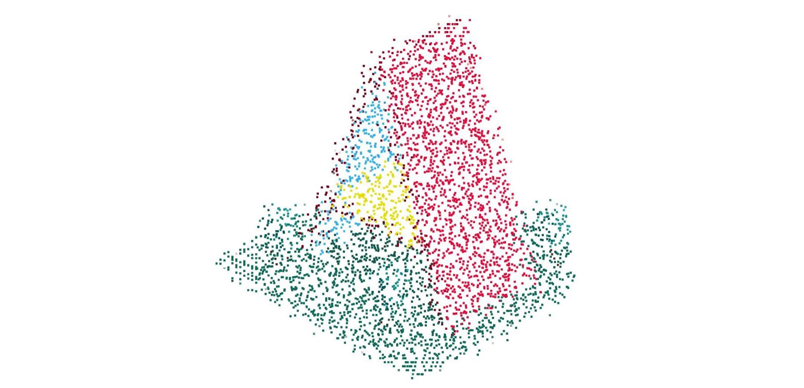

# A-Frame Component: Image Particles


### **Description / Rationale**
This is a component, which demonstrates particles effect as applied in relation to any image. The component also allows animating particles and change their types.   

### **Instructions**
To see the component at work add "image-particles" component to any empty entity. The component has the following attributes: 

* src: { type: 'string' } - the url to an image. It can be jpg or png.
* particleSize: { type: 'number', default: 5 } - the size of individual particle. The smaller it is, the more particleCount is required to cover the whole image. 
* particleCount: { type: 'number', default: 2000 } - the number of particles which will make up the image. It is set manually in order to cover whole image. 
* particleColor: { type: 'color', default: '' } - the color of the particles. If blank or white, it will show original colors as taken from the image. Otherwise it will show single colored particles across the whole image.
* particleOpacity: { type: 'number', default: 1 } - opacity of the particles. Can be from 0 to 1.
* particleSpeed: { type: 'number', default: 0.5 } - speed of the particle movement in seconds. The higher the faster it moves. If 0 particles remain idle. 
* particleSizeAttenuation: { type: 'boolean', default: true } - if true particle is square like, if false, particle is dot like.
* particleMotionDuration: { type: 'number', default: 1 } - duration it takes for the motion of particles, in seconds. The more it is, the more particles will be moving.
* particleDistance: { type: 'number', default: 200 } - max distance particles can travel from their origin. 
* particleDelay: { type: 'number', default: 3 } - initial delay in seconds before particle motion (if applied).

Example implementation is given below:
```
<html>
<head>
  <script src='https://aframe.io/releases/1.3.0/aframe.min.js'></script>
  <script src='js/image-particles-component.js'></script>
</head>
<body>
  <a-scene>
    <a-entity camera position="0 0 300" wasd-controls look-controls></a-entity>
    <a-entity
      image-particles="src: img/logo.png; particleSize: 5; particleCount: 4100; particleSpeed: 0.5; particleMotionDuration: 5"></a-entity>
    </a-scene>
</body>
</html>
```


### **Tech Stack**
The project is powered by AFrame and Three.js. 

### **Demo**
See demo of the component here: [Demo](https://img-particles.glitch.me/)
